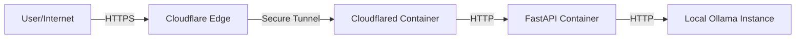

# Secure Local LLM API Gateway

## 🚀 Overview
This project provides a secure, production-ready gateway to access local Large Language Models (LLMs) running on **Ollama** from anywhere in the world. It utilizes **Cloudflare Tunnels** to expose the API securely without opening router ports, and a **FastAPI** wrapper to enforce authentication.

## 🏗️ Architecture
The system follows a secure, modular microservices architecture:



1.  **Cloudflare Tunnel (`cloudflared`)**: Creates an encrypted outbound connection to Cloudflare's edge network. No inbound firewall ports are opened.
2.  **API Gateway (`llm-api`)**: A Python FastAPI service that:
    *   Validates the custom `apikey`.
    *   Proxies requests to the local Ollama instance.
    *   Sanitizes inputs/outputs (extensible).
3.  **Ollama**: Runs natively on the host machine to leverage full GPU acceleration.

## 🛠️ Technology Stack
-   **Inference Engine**: [Ollama](https://ollama.com/) (running `gemma3:27b`)
-   **API Framework**: [FastAPI](https://fastapi.tiangolo.com/) (Python) - chosen for speed and ease of use.
-   **Containerization**: [Docker](https://www.docker.com/) & Docker Compose - ensures reproducible environments.
-   **Networking**: [Cloudflare Tunnel](https://www.cloudflare.com/products/tunnel/) (Zero Trust) - secure remote access.

## ✅ Best Practices & Security
This project was built with security and maintainability in mind:

### 1. Zero Trust Networking
-   **No Open Ports**: We do NOT open port 80/443 on the router. This prevents port scanning attacks.
-   **Encrypted Transport**: Traffic is encrypted from the user all the way to the local Docker container.

### 2. Secret Management
-   **Environment Variables**: Sensitive data (API Keys, Tunnel Tokens) are stored in a `.env` file.
-   **Git Ignore**: The `.env` file is explicitly ignored in `.gitignore` to prevent accidental leakage of secrets to GitHub.

### 3. Containerization
-   **Isolation**: The API and Tunnel run in isolated Docker containers.
-   **Networking**: A dedicated Docker network connects the Tunnel and API, ensuring the API is not directly exposed even on the local LAN interface (unless mapped).

## 🏃‍♂️ Quick Start

1.  **Clone the repo**:
    ```bash
    git clone https://github.com/ShahirShamim/llm-apis.git
    cd llm-apis
    ```

2.  **Configure Secrets**:
    Copy `.env.example` to `.env` and add your keys:
    ```bash
    cp .env.example .env
    # Edit .env with your API_KEY and TUNNEL_TOKEN
    ```

3.  **Run with Docker**:
    ```bash
    docker-compose up -d
    ```

## 📝 Usage
**Endpoint**: `https://api.yourdomain.com/generate`

```bash
curl "https://api.yourdomain.com/generate?apikey=YOUR_KEY&prompt=Why+is+the+sky+blue?"
```
